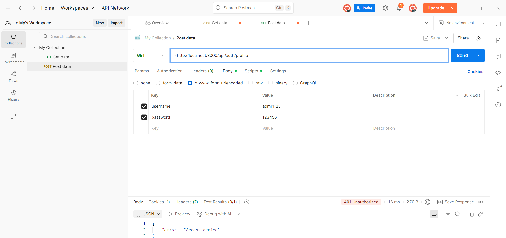
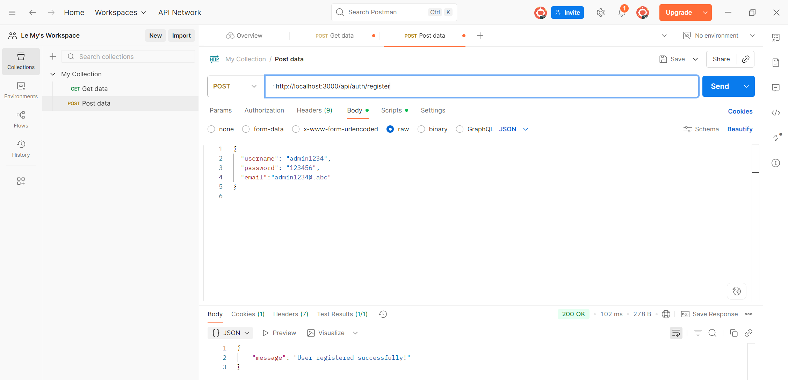
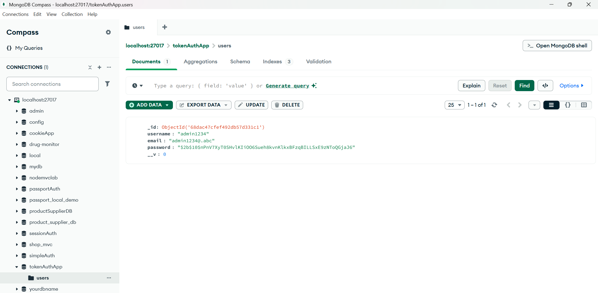
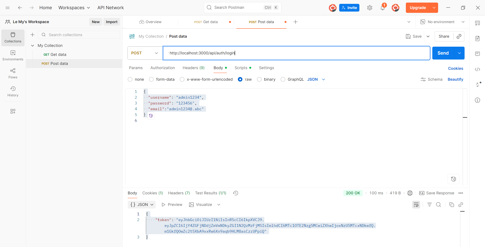
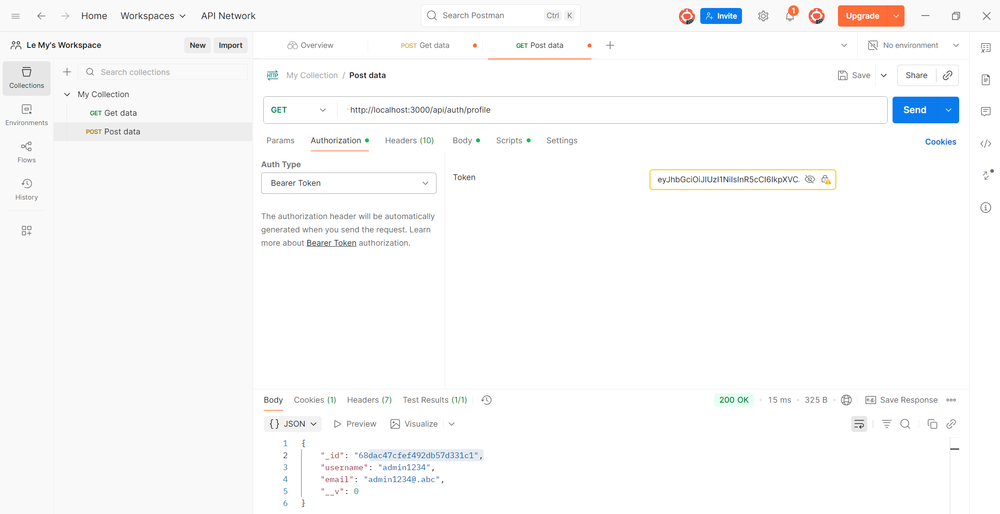

# Token Authentication

## Giới thiệu

Đây là project thực hành Authentication bằng Token (JWT) trong Node.js + MongoDB.
Ứng dụng sử dụng JSON Web Token (JWT) để xác thực và truy cập tài nguyên thay cho session/cookie.

Chức năng chính:

a. Gọi API Profile trước và sau khi có token để thấy sự khác biệt

b. Đăng ký (Register)

c. Đăng nhập (Login)

d.Lấy token để truy cập tài nguyên (Profile)

---
## Cài đặt 
```bash
git clone <https://github.com/LeHoangMy063/local_passport_auth_service>
cd local_passport_auth_service
npm install
```

## Chạy server

node app.js

Server mặc định chạy ở http://localhost:3000
---

## a. Gọi API Profile trước
1. Tạo một REQUEST mới

2. Ở phần METHOD

- GET: `http://localhost:3000/api/auth/profile`


Khi chưa login và chưa có token, API sẽ từ chối truy cập.

## b.Register
1. Tạo một REQUEST mới

2. Ở phần METHOD

- POST: `http://localhost:3000/api/auth/register` 

Body (JSON): 
```bash
{
  "username": "admin1234",
  "password": "123456",
  "email":"admin1234@.abc"
}
```
-> Send

Ảnh test:




{ "message": "User registered successfully!"}

## c. Login

1. Tạo một REQUEST mới

2. Ở phần METHOD

- POST: `http://localhost:3000/api/auth/login` 

Body (JSON): 
```bash
{
  "username": "admin1234",
  "password": "123456",
  "email":"admin1234@.abc"
}
```

Ảnh test:


## d. Profile

Yêu cầu: Đã login

- GET: `http://localhost:3000/api/auth/profile`

Body (JSON): 
```bash
{
  "username": "admin1234",
  "password": "123456",
  "email":"admin1234@.abc"
}
```

Authorization: Bearer Token

Dán mã token đã lấy được từ bước login 


